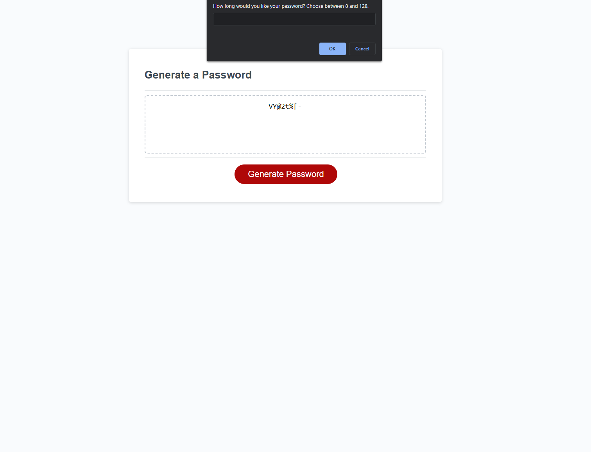

# 03 JavaScript: Password Generator

## Description

I completed this task as part of the 03 challenge for Javascript. This site will allow you to generate a password with 8 to 128 characters. You also get to choose whether your password includes special, uppercase, lowercase, and or numeric characters. Coding this project really helped me get a grip on the logic of Javascript and understand how to use functions and event listeners to manipulate the HTML DOM how we want.

## Installation

No need to install just run in browser. Link to deployed APP : https://n8hoang.github.io/03-challenge-Password-Gen/Develop/

## Usage

Click generate a password and you will be prompted with how long you want the password to be(8 to 128 characters). You will then be asked if you want to include special, uppercase, lowercase, and or numeric characters in your password. Once all the prompts are done the password will be generated inside the box on the page.

## Credits

Original code by UCLA. Added code by github.com/n8hoang

## License

MIT License

Copyright (c) [2023] [Nathan Hoang]

Permission is hereby granted, free of charge, to any person obtaining a copy
of this software and associated documentation files (the "Software"), to deal
in the Software without restriction, including without limitation the rights
to use, copy, modify, merge, publish, distribute, sublicense, and/or sell
copies of the Software, and to permit persons to whom the Software is
furnished to do so, subject to the following conditions:

The above copyright notice and this permission notice shall be included in all
copies or substantial portions of the Software.

THE SOFTWARE IS PROVIDED "AS IS", WITHOUT WARRANTY OF ANY KIND, EXPRESS OR
IMPLIED, INCLUDING BUT NOT LIMITED TO THE WARRANTIES OF MERCHANTABILITY,
FITNESS FOR A PARTICULAR PURPOSE AND NONINFRINGEMENT. IN NO EVENT SHALL THE
AUTHORS OR COPYRIGHT HOLDERS BE LIABLE FOR ANY CLAIM, DAMAGES OR OTHER
LIABILITY, WHETHER IN AN ACTION OF CONTRACT, TORT OR OTHERWISE, ARISING FROM,
OUT OF OR IN CONNECTION WITH THE SOFTWARE OR THE USE OR OTHER DEALINGS IN THE
SOFTWARE.
